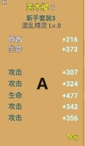
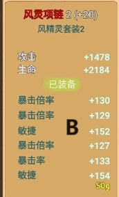

### 关于新人进阶4\.0及5\.0的攻略  

\-\-\-\-\-\-实力才是硬道理  

\-\-\-菜鸡老干妈献上  

### 机制

有几个机制和简单说明一下，理论上来说，100转以上的玩家必然能进5\.0，也就是22万战斗力，而5\.0被大家戏称为“大佬养老院”，也欢迎大家前（rang）来\(wo\)养\(zhuang\)老\(bi\)。

    ①1气力=1暴倍=1爆率=1战斗力
    ②1防御=1敏捷=1战斗力
    ③1幸运=1爆抗=1战斗力
    ④1攻击=2战斗力
    ⑤1生命=1战斗力

A装备是新手套3阶武器，5条附加属性（不计算最上方强化属性）提供的战斗力理论上大概在\[（307\+324\+342\+356）×2\+477\]=3135左右；  

B装备是风灵2阶项链，6条附加属性（不计算最上方强化属性）提供的战斗力理论上大概在\[130\+129\+152\+127\+133\+154\]=825左右；  

为什么说是理论值呢，因为当前版本每条装备属性都有属性上限，你所计算出的数值大都会下浮几点，不过不影响大体战斗力。

通过对比，能让大家从感官上对攻击所产生的战斗力体会更加深刻，而且加之骑宠放大后，效果更加。

但这里的目的不是让大家盲目叠攻击，值得注意的是，除攻击和生命外，每件15阶装备的基础属性基本都是在85\-100间，也就是敏捷、防御、爆率、暴倍、气力等属性，而攻击都是200\+，生命则是300\+（生命虽然比攻击高，但1生命只提供1战斗力），所以在叠加战斗力方面，攻击与生命具有明显的优势。

而生命的优势在于角色成长，因为在角色成长界面，1点成长等于5点生命，也就是说，你的37还是50点成长全部点在生命上的（虚拟）战斗力是最高的，很多大佬在初期进入5\.0时都是全生命，例如涟漪女帝，还有你们的萌新指导员夏至同志。

### 怎样提高你的战斗力  

第一部分只是阐述以下战斗力机制，而不是推荐大家全身攻击、生命装，当然你理解成为搞一套15阶新手3阶攻血装作为零点偷鸡专用也可以。

那么5\.0的22万战斗力怎么能达到呢，角色红利固定是敏捷，这个千万不要动，可以选择的有以下几点 ：

1. 骑宠选择：全满金年兽是最佳的，其次红爆、机暴只要是满的都无所谓；
2. 宠物蛋选择：乌力蛋是最佳阶段（不要盲目的去打新蛋，5级兔子比5级猪低了近2万战斗力），而作为坐骑，黄猪对你的战斗力综合提升最大，所以5级黄猪能够为你提供海量的战斗力，记得耐心些抓点210血以上的猛犸孵化；
3. 装备选择：现阶段最佳选择5风\+3火，观察每件装备的强化属性，例如：风戒指\+爆率，风鞋子\+敏捷，自己搭配；PS:火项链和风腰带不要搞混，这两件都是\+气力的，千万别身上带着风项链和火腰带。。。那样你的角色就只有100气力了。
4. 装备强化：利用有限的资源去强化最能提升自己的装备，比如：火灵武器提供的是2条攻击属性，你强化到\+20，会为你提供2900的攻击力也就是5800左右的战斗力，而你把腰带强化到\+20，只会给你提供1470\+气力和720\+幸运，加起来只有2100\+战斗力，得不偿失。
5. 宠物技能：攻骑宠777，敏骑宠666，这里既然说战斗力这个梗，自然选择攻骑宠777，配合角色自身攻击，提升战斗力。
6. 角色成长：当你骑宠777，黄猪3级，装备5\+3强化15以后，角色战斗力在20万左右时，你可以尝试全攻击配骑宠777，或者全生命骑宠777，试着达到22万。。。
7. 谨记这一切勉强达到标准的目标是偷鸡，真的不是你实力达到了标准可以无脑飞人的程度，勉强进坑的苦果就是任何一个坑里的人都能反日你，你的终极目标是全敏成长苦修者26级骑着幻境暴龙进5\.0；
8. 装逼有风险，入坑需谨慎。  

大魔王:c8v9sdj8awm893  

老干妈：来啊都来5\.0造作啊！  

夏至：让我露个脸！  

